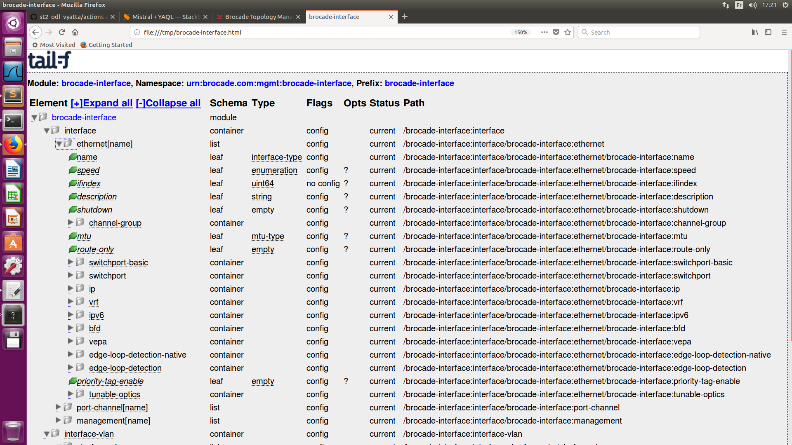

# YANG for SLX-OS (Using YANG tools):

## Introduction:
- YANG is ...
- Some links:
  - https://github.com/mbj4668/pyang/wiki/Tutorial
  - https://www.ietf.org/edu/tutorials/90-YANG-Tutorial.pdf

## Content of this repo:
- [Validate yang modules](https://github.com/mab27/nw_automation_on_slx/tree/master/yang#validate-yang-modules)
- [Convert yang into yin](https://github.com/mab27/nw_automation_on_slx/tree/master/yang#convert-yang-into-yin)
- [Generate a tree representation of YANG models](https://github.com/mab27/nw_automation_on_slx/tree/master/yang#validate-yang-modules)
- [Generates Python classes from a YANG module](https://github.com/mab27/nw_automation_on_slx/tree/master/yang#generates-python-classes-from-a-yang-module)

## Validate yang modules:
```

```

## Convert yang into yin:
```

```

## Generate a tree representation of YANG models:

- This is helpful for quick visualization:
- Let's look a sample data-model and display it all:

```
mab@mab-infra:~/mab_automate/nw_automation_on_slx/yang/yang_modules/17r.1.01a$ pyang -f tree brocade-interface.yang 
brocade-interface.yang:74: warning: the revision statements are not given in reverse chronological order
module: brocade-interface
    +--rw interface
    |  +--rw ethernet* [name]
    |  |  +--rw name                          interface-type
    |  |  +--rw speed?                        enumeration
    |  |  +--ro ifindex?                      uint64
    |  |  +--rw description?                  string
    |  |  +--rw shutdown?                     empty
    |  |  +--rw channel-group
    |  |  |  +--rw port-int?   portchannel-type
    |  |  |  +--rw mode?       po-mode
    |  |  |  +--rw type?       po-type
    |  |  +--rw mtu?                          mtu-type
    |  |  +--rw route-only?                   empty
    |  |  +--rw switchport-basic
    |  |  |  +--rw basic?   empty
    |  |  +--rw switchport
    |  |  |  +--rw mode
    |  |  |  |  +--rw vlan-mode?   l2-mode-type
    |  |  |  +--rw port-security!
    |  |  |  |  +--rw port-sec-max?                uint32
    |  |  |  |  +--rw port-sec-violation?          port-sec-violation
    |  |  |  |  +--rw port-security-mac-address* [mac-address port-sec-vlan]
    |  |  |  |  |  +--rw mac-address      mac-address-type
    |  |  |  |  |  +--rw port-sec-vlan    vlan-type
    |  |  |  |  +--rw sticky
    |  |  |  |  |  +--rw sticky-flag?                 empty
    |  |  |  |  |  +--rw port-security-mac-address* [mac-address port-sec-vlan]
    |  |  |  |  |     +--rw mac-address      mac-address-type
    |  |  |  |  |     +--rw port-sec-vlan    vlan-type
    |  |  |  |  +--rw shutdown-time?               uint32
    |  |  |  +--rw access
    |  |  |  |  +--rw accessvlan?     vlan-type
    |  |  |  |  +--rw rspan-access
    |  |  |  |     +--rw rspan-access-vlan?   vlan-type
    |  |  |  +--rw trunk
    |  |  |     +--rw allowed
    |  |  |     |  +--rw vlan
    |  |  |     |  |  +--rw all?      empty
    |  |  |     |  |  +--rw none?     empty
    |  |  |     |  |  +--rw add?      ui32-vlan-20k-range
    |  |  |     |  |  +--rw except?   ui32-1k-vlan-range
    |  |  |     |  |  +--rw remove?   ui32-1k-vlan-range
    |  |  |     |  x--rw vlanoper
    |  |  |     |  |  +--rw vlan
    |  |  |     |  |     +--rw add?      ui32-vlan-range
    |  |  |     |  |     +--rw remove?   ui32-vlan-range
    |  |  |     |  +--rw rspan-vlan
    |  |  |     |     +--rw add-rspan-trunk-vlan?      ui32-1k-vlan-range
    |  |  |     |     +--rw remove-rspan-trunk-vlan?   ui32-1k-vlan-range
    |  |  |     +--rw tag!
    |  |  |     |  +--rw native-vlan?   empty
    |  |  |     +--rw native-vlan-classification
    |  |  |        +--rw native-vlan-id?   native-vlan-type
    |  |  +--rw ip
    |  |  +--rw vrf
    |  |  |  +--rw forwarding?   common-def:vrf-name
    |  |  +--rw ipv6
    |  |  +--rw bfd
    |  |  |  +--rw interval
    |  |  |  |  +--rw min-tx?       bfd-tx-interval-type
    |  |  |  |  +--rw min-rx?       bfd-rx-interval-type
    |  |  |  |  +--rw multiplier?   bfd-multiplier-type
    |  |  |  +--rw bfd-shutdown?   empty
    |  |  +--rw vepa
    |  |  |  +--rw vepa-enable?   empty
    |  |  +--rw edge-loop-detection-native
    |  |  |  +--rw loop-detection-native?   empty
    |  |  +--rw edge-loop-detection
    |  |  |  +--rw eldprio?               uint32
    |  |  |  +--rw eldshutdown-disable?   empty
    |  |  |  +--rw eldvlan?               ui32-vlan-range
    |  |  +--rw priority-tag-enable?          empty
    |  |  +--rw tunable-optics
    |  |     +--rw sfpp
    |  |        +--rw channel?   tunable-optics-sfpp-channel-type
    |  +--rw port-channel* [name]
    |  |  +--rw name                          portchannel-type
    |  |  +--rw po-speed?                     enumeration
    |  |  +--rw insight
    |  |  |  +--rw insight-enable?   empty
    |  |  |  +--rw insight-mmId?     uint8
    |  |  +--ro ifindex?                      uint64
    |  |  +--rw description?                  string
    |  |  +--rw shutdown?                     empty
    |  |  +--rw minimum-links?                uint32
    |  |  +--rw mtu?                          mtu-type
    |  |  +--rw route-only?                   empty
    |  |  +--rw switchport-basic
    |  |  |  +--rw basic?   empty
    |  |  +--rw switchport
    |  |  |  +--rw mode
    |  |  |  |  +--rw vlan-mode?   l2-mode-type
    |  |  |  +--rw port-security!
    |  |  |  |  +--rw port-sec-max?                uint32
    |  |  |  |  +--rw port-sec-violation?          port-sec-violation
    |  |  |  |  +--rw port-security-mac-address* [mac-address port-sec-vlan]
    |  |  |  |  |  +--rw mac-address      mac-address-type
    |  |  |  |  |  +--rw port-sec-vlan    vlan-type
    |  |  |  |  +--rw sticky
    |  |  |  |  |  +--rw sticky-flag?                 empty
    |  |  |  |  |  +--rw port-security-mac-address* [mac-address port-sec-vlan]
    |  |  |  |  |     +--rw mac-address      mac-address-type
    |  |  |  |  |     +--rw port-sec-vlan    vlan-type
    |  |  |  |  +--rw shutdown-time?               uint32
    |  |  |  +--rw access
    |  |  |  |  +--rw accessvlan?   vlan-type
    |  |  |  +--rw trunk
    |  |  |     +--rw allowed
    |  |  |     |  +--rw vlan
    |  |  |     |  |  +--rw all?      empty
    |  |  |     |  |  +--rw none?     empty
    |  |  |     |  |  +--rw add?      ui32-vlan-20k-range
    |  |  |     |  |  +--rw except?   ui32-1k-vlan-range
    |  |  |     |  |  +--rw remove?   ui32-1k-vlan-range
    |  |  |     |  x--rw vlanoper
    |  |  |     |     +--rw vlan
    |  |  |     |        +--rw add?      ui32-vlan-range
    |  |  |     |        +--rw remove?   ui32-vlan-range
    |  |  |     +--rw tag!
    |  |  |     |  +--rw native-vlan?   empty
    |  |  |     +--rw native-vlan-classification
    |  |  |        +--rw native-vlan-id?   native-vlan-type
    |  |  +--rw ip
    |  |  +--rw ipv6
    |  |  +--rw edge-loop-detection-native
    |  |  |  +--rw loop-detection-native?   empty
    |  |  +--rw edge-loop-detection
    |  |  |  +--rw eldprio?               uint32
    |  |  |  +--rw eldshutdown-disable?   empty
    |  |  |  +--rw eldvlan?               ui32-vlan-range
    |  |  +--rw priority-tag-enable?          empty
    |  |  +--rw load-balance-type?            enumeration
    |  +--rw management* [name]
    |     +--rw name                        standalone-man-interface-type
    |     +--rw tcp
    |     |  +--rw tcp_burstrate?   uint32
    |     |  +--rw tcp_lockdown?    uint32
    |     +--rw ip
    |     |  +--rw icmp
    |     |  |  +--rw rate_limiting?   uint32
    |     |  +--rw address
    |     |  |  +--rw dhcp?         empty
    |     |  |  +--rw ip-address?   common-def:ipv4-address-prefix-type
    |     |  +--rw oper-address
    |     |  |  +--ro oper-ip-address?   common-def:ipv4-address-prefix-type
    |     |  +--rw oper-gateway-con
    |     |     +--ro oper-gateway?   inet:ipv4-address
    |     +--rw ipv6
    |     |  +--rw icmpv6
    |     |  |  +--rw v6_rate_limiting?   uint32
    |     |  +--rw ipv6-address-cont
    |     |  |  +--rw ipv6-global-cont
    |     |  |     +--rw ipv6-global-address?         common-def:ipv6-address-prefix
    |     |  |     +--rw ipv6-global-address-eui64?   empty
    |     |  +--ro ipv6-address*        string
    |     |  +--ro ipv6-gateways*       string
    |     +--rw vrf
    |     |  +--rw vrf-forwarding?   common-def:vrf-name
    |     +--rw speed?                      enumeration
    |     +--rw line-speed
    |     |  +--ro actual?       string
    |     |  +--ro configured?   string
    |     +--rw shutdown_management?        empty
    |     +--ro shutdown_management_oper?   string
    +--rw interface-vlan
    |  +--rw vlan* [name]
    |     +--rw name                vlan-type
    |     +--rw statistics?         empty
    |     +--rw loop-detection?     empty
    |     +--rw router-interface
    |     |  +--rw ve-config?   ve-type
    |     +--ro ifindex?            uint64
    |     +--rw description?        string
    |     +--rw vlan-name?          string
    |     +--rw ip
    +--rw protocol
  augment /common-def:routing-system:
    +--rw protocol
    +--rw interface
       +--rw ve* [name]
          +--rw name    ve-type
          +--rw bfd
             +--rw interval
             |  +--rw min-tx?       bfd-tx-interval-type
             |  +--rw min-rx?       bfd-rx-interval-type
             |  +--rw multiplier?   bfd-multiplier-type
             +--rw bfd-shutdown?   empty
mab@mab-infra:~/mab_automate/nw_automation_on_slx/yang/yang_files/17r.1.01a$ 
```

- Generate the same representation on a clickable webpage (more convinient):
	- Type the below command.
	- then open a broswer and search for ```file:///tmp/brocade-interface.html```
```
mab@mab-infra:~/mab_automate/nw_automation_on_slx/netconf_restconf/yang-tools/yang_modules/17r.1.01a$ pyang -f jstree brocade-interface.yang >/tmp/brocade-interface.html
brocade-interface.yang:74: warning: the revision statements are not given in reverse chronological order
mab@mab-infra:~/mab_automate/nw_automation_on_slx/netconf_restconf/yang-tools/yang_modules/17r.1.01a$ 
```



- Looking for a bigger data model and diplay only the 5 levels:

```
mab@mab-infra:~/mab_automate/nw_automation_on_slx/yang/yang_yang_modules/17r.1.01a$ pyang -f tree brocade-bgp.yang --tree-depth=5
module: brocade-bgp
  augment /common-def:routing-system:
    +--rw evpn-config
       +--rw evpn
          +--rw evpn-instance* [instance-name]
             +--rw instance-name          evpn-type
             +--rw route-target
             |  +--rw both* [target-community]
             |  |     ...
             |  +--rw export* [target-community]
             |  |     ...
             |  +--rw import* [target-community]
             |        ...
             +--rw route-distinguisher
             |  +--rw (ch-rd-type)?
             |        ...
             +--rw duplicate-mac-timer
             |  +--rw duplicate-mac-timer-value?   dup-mac-timer
             |  +--rw max-count?                   max-count
             +--rw bridge-domain
             |  +--rw bd-add
             |  |     ...
             |  +--rw evpn-bd* [bd-number]
             |        ...
             +--rw vlan
                +--rw vlan-add
                |     ...
                +--rw evpn-vlan* [vlan-number]
                      ...
  augment /common-def:routing-system/common-def:router:
    +--rw router-bgp!
       +--rw router-bgp-attributes
       |  +--rw local-as?                      local-as-type
       |  +--rw always-compare-med?            empty
       |  +--rw compare-med-empty-aspath?      empty
       |  +--rw med-missing-as-worst?          empty
       |  +--rw as-path-ignore?                empty
       |  +--rw compare-routerid?              empty
       |  +--rw install-igp-cost?              empty
       |  +--rw cluster-id
       |  |  +--rw (ch-cluster-id)?
       |  |     +--:(ca-cluster-id)
       |  |     |     ...
       |  |     +--:(ca-cluster-id-ipv4-address)
       |  |           ...
       |  +--rw default-local-preference?      local-preference-number
       |  +--rw distance
       |  |  +--rw ext-route-distance?   ext-route-distance
       |  |  +--rw int-route-distance?   int-route-distance
       |  |  +--rw lcl-route-distance?   lcl-route-distance
       |  +--rw capability
       |  |  +--rw as4-enable?   empty
       |  +--rw maxas-limit
       |  |  +--rw in
       |  |     +--rw num-as-in-path?   num-as-in-path
       |  +--rw enforce-first-as?              empty
       |  +--rw fast-external-fallover?        empty
       |  +--rw timers
       |  |  +--rw keep-alive?   nei-keep-alive
       |  |  +--rw hold-time?    nei-hold-time
       |  +--rw log-dampening-debug?           empty
       |  +--rw confederation
       |  |  +--rw identifier?   cidentifier
       |  |  +--rw peers*        cidentifier
       |  +--rw bfd
       |  |  +--rw holdover-interval?   bfd:bfd-holdover-interval
       |  |  +--rw interval
       |  |     +--rw min-tx?       bfd-tx-interval-type
       |  |     +--rw min-rx?       bfd-rx-interval-type
       |  |     +--rw multiplier?   bfd-multiplier-type
       |  +--rw auto-shutdown-new-neighbors?   empty
       |  +--rw neighbor
       |     +--rw peer-grps
       |     |  +--rw neighbor-peer-grp* [router-bgp-neighbor-peer-grp]
       |     |        ...
       |     +--rw neighbor-ipv6s
       |     |  +--rw neighbor-ipv6-addr* [router-bgp-neighbor-ipv6-address]
       |     |        ...
       |     +--rw neighbor-ips
       |        +--rw neighbor-addr* [router-bgp-neighbor-address]
       |              ...
       +--rw address-family
          +--rw ipv4
          |  +--rw ipv4-unicast
          |     +--rw default-vrf
          |     |     ...
          |     +--rw af-vrf* [af-vrf-name]
          |           ...
          +--rw ipv6
          |  +--rw ipv6-unicast
          |     +--rw default-vrf
          |     |     ...
          |     +--rw af-ipv6-vrf* [af-ipv6-vrf-name]
          |           ...
          +--rw l2vpn
          |  +--rw evpn!
          |     +--rw client-to-client-reflection?   empty
          |     +--rw graceful-restart
          |     |     ...
          |     +--rw retain
          |     |     ...
          |     +--rw vtep-discovery?                empty
          |     +--rw neighbor
          |           ...
          +--rw vpnv4
          |  +--rw vpnv4-unicast!
          |     +--rw rr-group?                           rr-group-type
          |     +--rw export-vrf-leaked-routes?           empty
          |     +--rw af-vpn-neighbor-peergroup-holder
          |     |     ...
          |     +--rw af-vpnv4-neighbor-address-holder
          |           ...
          +--rw vpnv6
             +--rw vpnv6-unicast!
                +--rw rr-group?                           rr-group-type
                +--rw export-vrf-leaked-routes?           empty
                +--rw af-vpn-neighbor-peergroup-holder
                |     ...
                +--rw af-vpnv6-neighbor-address-holder
                      ...
mab@mab-infra:~/mab_automate/nw_automation_on_slx/yang/yang_files/17r.1.01a$ 
```

- Looking for a bigger data model and diplay a specific section:
```
mab@mab-infra:~/mab_automate/nw_automation_on_slx/yang/yang_modules/17r.1.01a$ pyang -f tree brocade-bgp.yang --tree-path=/router-bgp/address-family/l2vpn
module: brocade-bgp
  augment /common-def:routing-system:
    +--rw evpn-config
  augment /common-def:routing-system/common-def:router:
    +--rw router-bgp!
       +--rw address-family
          +--rw l2vpn
             +--rw evpn!
                +--rw client-to-client-reflection?   empty
                +--rw graceful-restart
                |  +--rw graceful-restart-status?   empty
                |  +--rw restart-time?              rtime-type
                |  +--rw purge-time?                ptime-type
                |  +--rw stale-routes-time?         st-time-type
                +--rw retain
                |  +--rw route-target
                |     +--rw all?   empty
                +--rw vtep-discovery?                empty
                +--rw neighbor
                   +--rw evpn-peer-group* [evpn-neighbor-peergroup-name]
                   |  +--rw evpn-neighbor-peergroup-name    bgp-peergroup
                   |  +--rw encapsulation?                  encapsulation-t
                   |  +--rw maximum-prefix?                 max-prefix-limit
                   |  +--rw route-reflector-client?         empty
                   |  +--rw allowas-in?                     uint32
                   |  +--rw next-hop-unchanged?             empty
                   |  +--rw enable-peer-as-check?           empty
                   |  +--rw route-map
                   |  |  +--rw direction-in
                   |  |  |  +--rw route-map-name-direction-in?   common-def:name-string64
                   |  |  +--rw direction-out
                   |  |     +--rw route-map-name-direction-out?   common-def:name-string64
                   |  +--rw activate?                       empty
                   |  +--rw send-community
                   |     +--rw send-community-status?   empty
                   |     +--rw both?                    empty
                   |     +--rw extended?                empty
                   |     +--rw standard?                empty
                   +--rw evpn-neighbor-ipv4* [evpn-neighbor-ipv4-address]
                   |  +--rw evpn-neighbor-ipv4-address    inet:ipv4-address
                   |  +--rw encapsulation?                encapsulation-t
                   |  +--rw maximum-prefix?               max-prefix-limit
                   |  +--rw route-reflector-client?       empty
                   |  +--rw allowas-in?                   uint32
                   |  +--rw next-hop-unchanged?           empty
                   |  +--rw enable-peer-as-check?         empty
                   |  +--rw route-map
                   |  |  +--rw direction-in
                   |  |  |  +--rw route-map-name-direction-in?   common-def:name-string64
                   |  |  +--rw direction-out
                   |  |     +--rw route-map-name-direction-out?   common-def:name-string64
                   |  +--rw activate?                     empty
                   |  +--rw send-community
                   |     +--rw send-community-status?   empty
                   |     +--rw both?                    empty
                   |     +--rw extended?                empty
                   |     +--rw standard?                empty
                   +--rw evpn-neighbor-ipv6* [evpn-neighbor-ipv6-address]
                      +--rw evpn-neighbor-ipv6-address    inet:ipv6-address
                      +--rw encapsulation?                encapsulation-t
                      +--rw maximum-prefix?               max-prefix-limit
                      +--rw route-reflector-client?       empty
                      +--rw allowas-in?                   uint32
                      +--rw next-hop-unchanged?           empty
                      +--rw enable-peer-as-check?         empty
                      +--rw route-map
                      |  +--rw direction-in
                      |  |  +--rw route-map-name-direction-in?   common-def:name-string64
                      |  +--rw direction-out
                      |     +--rw route-map-name-direction-out?   common-def:name-string64
                      +--rw activate?                     empty
                      +--rw send-community
                         +--rw send-community-status?   empty
                         +--rw both?                    empty
                         +--rw extended?                empty
                         +--rw standard?                empty
mab@mab-infra:~/mab_automate/nw_automation_on_slx/yang/yang_modules/17r.1.01a$
```

## Generates Python classes from a YANG module:

### Introduction to pyangbind (a pyang plugin)

WORK IN PROGRESS !!!

- https://github.com/robshakir/pyangbind

- Pyang uses a pointer to identify where pyang-bind plugin is installed: 
```
mab@mab-infra:~$ export PYBINDPLUGIN=`/usr/bin/env python -c \
> 'import pyangbind; import os; print "%s/plugin" % os.path.dirname(pyangbind.__file__)'`
mab@mab-infra:~$ echo $PYBINDPLUGIN
/home/mab/.local/lib/python2.7/site-packages/pyangbind/plugin
mab@mab-infra:~$ 
mab@mab-infra:~$ 
```
- That will allows you to use ```--plugindir $PYBINDPLUGIN ``` when calling pyang.


```

```

